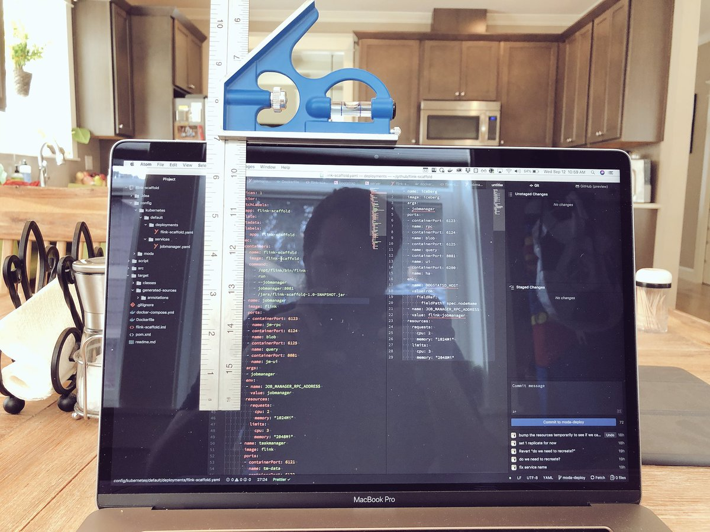

# API Overview

Teabox is communicating with your program via Unix socket on the localhost.
It is configured in general configuration:

```yaml
callback: /tmp/teabox.sock
```

Your script may send signals to the GUI like to a simple display/monitor,
to reflect something (depends on what it is doing at the very moment).

To perform an API call, simply send the content as a text data to the receiving socket.
For example, a shell script can use just a `netcat` or `socat` command. Important
is that the each call detaches from the socket, closing it.

## Authentication

Currently there is no any security or tokens mechanism to access the socket.
Planned feature is to export a random token into the environment variable `TEABOX_ADDR`
which will contain a random token, which could be passed to the API call. This might
prevent accessing the same Unix socket from the localhost by other process.

Syntax would be:

    <API call>@<ADDR>:[type]:[payload]

This can be read as "set progress **at** a specific socket".

## Usage

API can accept two kind of protocols:

1. Plain text with a specific syntax
2. JSON

> 👉🏻 JSON is used only for complex data structures, such as tabular widgets.

Even though it is possible, but still a much better idea is to use JSON from something
more advanced than just a shell script, e.g. Python.

### Simple syntax

#### General format

Simple syntax is just a plain text, separated by colons ":" on this format:

    <API call>:[type]:[payload]

That's right, "type" and "payload" are optional. For example, to tell a progress bar
to jump one step forward during the form load, is enough to just do this call:

    init.progress.next::

#### Supported types

Simple syntax is simple. The UI is basically to collect data and display you some
progress. Therefore currently there are only three types that are currently supported:

1. `string` (this is also default type, if not specified)
2. `int`
3. `bool`

#### Key/values

Simple syntax also supports a very simple key/value concept. For example, you want to
remove or update a specific item in the drop-down, which has previously was assigned an ID:

    <API call>:[type]:{key}value

> 👉🏻 Note, that the `value` can contain colons too. The API call and a type cannot contain it and
> therefore colon works like a separator.

This example of a key/value API call, which is taken from the generic examples of the project
is adding a list item with a title "Add potatoes" and can be referred by the ID "potato".
String type specification is omitted deliberately:

    common.list.add::"{potato}Add potatoes"


### JSON

This kind of overcomplicated data structure is only good for a tabular data. For example, you want to
display the information of available packages in the system or display which are
installed, which are not. You also want to specify which field of the table is value,
which is hidden etc. This kind of data cannot be easily managed with the "Simple syntax",
therefore you use JSON.

At least it is [not YAML](https://www.reddit.com/r/ProgrammerHumor/comments/9fhvyl/writing_yaml/):

