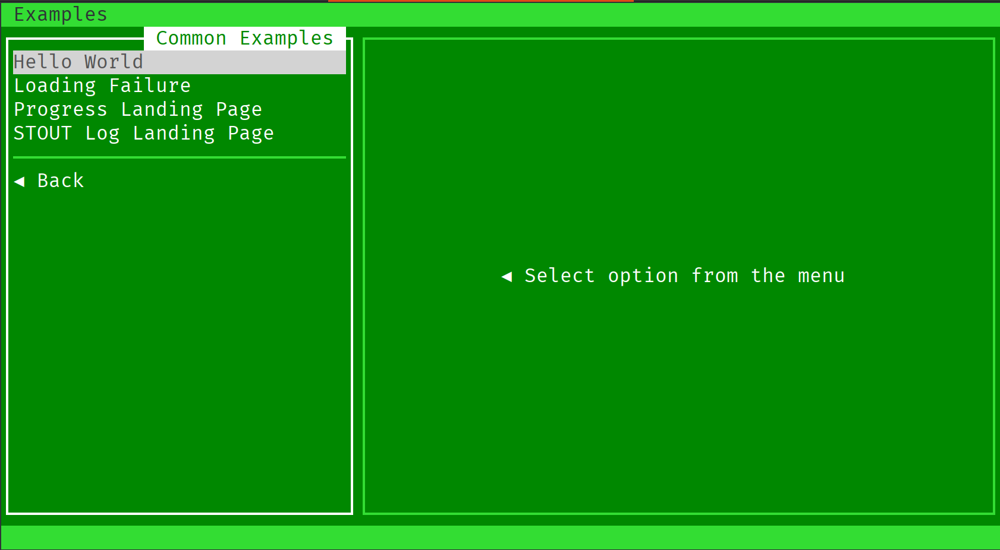

# Writing a module (configuration)

Writing module is actually quite easy. Unlike YaST or Anaconda or similar projects,
Teabox does not limits you in anything. A module is just a standalone executable in any
kind of form, as long as it meets the following (POSIX standard) requirements:

- Can at least output to the STDOUT
- Returns a standard POSIX exit code

Optionally:

- Output to STDERR
- Receive STDIN

## Module concept

A module in Teabox is essentially a wrapper around a command (or even a direct call of
a program, if that is completely sufficient), but typically a wrapper. Choose wisely
which language you want to use, but typically just a Shell script is almost always
enough.

Each module has its own configuration file, called `init.conf` and its own directory,
which is inside of the module suite (see below).

### Call cycle

During a call, a module has three phases, such as:

1. Gathering existing data, if any, and pre-loading the UI form with the corresponding values.
2. Displaying the UI form with the values.
3. The data from the UI form is then formed as a parameters to your command or a wrapper script,
   and the launch happens. Durinth this launch a "landing window" is displayed to either show
   just standard output, or progress bar, or any other form of progress.

## Modules suite

Modules suite is just a directory with the initial configuration `init.conf` and Teabox
is pointed to it in its general configuration. All modules are simply directories inside.
It does not matter how the directories are organised, as long as there is a directory with
the `init.conf` file in it.

Modules can be optionally grouped by their topic, using their configuration. However, it does
not matter in which directory a module is physically located, as long as it is within the
entire suite directory.

> It is still a very good idea to organise modules using directores, so they are not randomly
> placed, causing trouble finding them.

## Module `init.conf`

Before anything, `init.conf` must define the UI, which will generate an input form with corresponding
widgets, those are used to construct a command line for the target call.

All the configuration of Teabox is using YAML syntax and is self-descriptive (most of the time) to
understand. To begin with, define module common attributes, such as its name/title, an optional group name
if a module should be grouped into a specific topic etc.

### General settings

To define a title, just do it straight-forward:
```yaml
# Title/name of the module
title: STOUT Log Landing Page
```

A group is optional. However, in a current implementation group has no ID, just a string directly.
This group should be the same across all the modules. If a string is different (other Unicode character etc),
then you will get two groups. In a future, `group` might have also `group-id` option:

```yaml
# An optional group definition
group: Common Examples
```

### Setup phase

Before module form is shown in the UI, setup command is called. Setup command is used to pre-load the UI
with the data, which is gathered at this phase. Form filling and any other communication with your module
and the Teabox is done throgh the API via Unix socket on the localhost. This socket is opened only during
the runtime and is closed and removed when the module call is over. The socket path is configured in the
main configuration, and how to communicate with it — is up to you. In a Shell script, for example, you can
use just `socat` or `netcat` programs, using Teabox API.

> NOTE: Setup command is a full "as is" command, so any complete arguments are also allowed.
> Typically, setup is just another runtime mode of your module, so typically just `--setup`
> parameter should be fully sufficient.

```yaml
setup: example-module.sh --setup
```

### Landing screen

Landing screen or report form is the screen that is shown right after user clicks "Start" button, and your
module starts running. This landing screen can show a progress bar, display some progress messages or just
show the STDOUT etc. There are currently two landing screens:

- `logger` (default)
- `progress`

The logger screen only shows the STDOUT and has a status bar to inform user what is generally happening.
The progress screen is a bit more advanced and has additional features, such as progress bar, current event
message, a "todo list" of items that gets checked once they are completed and a general information text area
that supports dynamic colors.

The `logger` is default and does not have to be explicitly defined in the configuration:

```yaml
landing: logger
```

### Conditions

There are conditions, under which your module runs or doesn't. For example, sometimes you want to setup 
something, but you want to do it only once. The second call of the same setup would not be necessary, so
you want to block it, informing user about it. Or you want to make sure that the requirements for your
module are met.

This is done with the `conditions` directive, which is an infinite list of conditions. It is set the
following way:

```yaml
conditions:
  - ...
  - ...
  - ...
```

Each condition has a preposition and an action what to do _otherwise_. For example:

```yaml
conditions:
  - absent: /var/run/apt.lock
    message: "Package manager is currently running!"

  - present: /etc/hosts
    message: "Unable to find /etc/hosts"
```

### The UI and the arguments

Now to the cool stuff: the UI definition and arguments construction.

Apart from single forms that showes "Start" or "Cancel" buttons, Teabox also allows to use batches
in classic Windows "next/next/next/finish" style. This is done by the `commands` directive, which is
a list of commands. Think of an each command as a separate UI form. Currently teabox supports only
one form per a command (this might change in a future).

Each command is basically a set of directives:

```yaml
commands:
  - path: ...
    title: ...
    flags: ...
    args: ...

  - path: ...
    title: ...
    ...
```

#### `path`
The `path` directive can be either absolute or none path to the command. For example, sometimes it is
maybe a good idea to call some specific command (very rare cases, usually unused):

```yaml
path: /usr/bin/something
```

Or just call a wrapper from the current module (and this is the usual, typical use case):

```yaml
path: my-wrapper.sh
```

#### `title`

This directive is a label of the menu item and then a title on the UI form. Type `string`.

#### `flags`

The directive `flags` is a list of strings. These are just flags to the executable in the command-line.
For example, if a command in `path` can accept a flag `-q` which makes it "quiet" to the STDOUT and you
want it so, then describe it this way:

```yaml
- path: my-example.sh
  flags:
    - -q
```

Then the called command will be:

    my-example.sh -q

Since this is a list, you may add more flags. Order of this directive will also affect how the command
line is constructed. Some programs oddly is paying attention to the flags order, so you can directly
control that behaviour as well.

> Note: this is a list of static flags that *always* will be passed in. If you want control them in a form
> as toggle checkboxes, you have to use them as arguments (see below).

#### `args`

This is the arguments directive. Arguments usually have key/value form. If an argument has no value and
it affects the program by mere presence (or absence) of the argument, then it is a "toggle" argument.

The directive `args` is just a list of arguments, while an argument is a structure, which describes
many aspects of an argument, such as:

- `type`: widget type on the form
- `name`: The argument key, e.g. `--arch` or `--log-level` etc.
- `label`: The abel for the UI (`string` type)
- `options`: Possible options to choose (or values). This is a compex option, described below.
- `attributes`: a list of attributes of the field (explained below).

Example:

```yaml
args:
  - type: dropdown
    name: --arch
    label: Architecture
    attributes:
      - skip-empty
    options:
      - ["Intel 64bit", string, "x86_64"]
      - ["ARM 64bit", string, "aarch_64"]
```

While `type`, `name` and `label` are just strings, the directive `options` has its own structure and rules.
This directive is a two-dimensional array, where each element has a strict structure, depending on the widget.

`attributes`

Attributes are just flags to the given argument and written just as a list of `attributes` key. Currently
implemented attributes:

Common attributes:
- `skip-empty`
  Omit empty named argument. Since teabox **always** adds a given option to a target script by default,
  this attribute allows to omit a named argument in the command line, if no value given.

- `view-only`
  Teabox will **never** send this field as an option or a named argument. It turns any field only for
  information purposes. For example, to show a table with existing repositories or users or user groups etc.

Attributes for `tabular` widget only:
- `selector`
  If specified, tabular will show "selected row" column in front of others, displaying a bullet point
  for visual recognition of selected items.

- `hidden = <INT>`
  Indicates if a specified column is hidden. Example: `hidden = 3`.

- `value = <INT>`
  Indicates if a column is a value, so its content is used when the row is selected.
  Usually this is a composite column and it is usually hidden. Example: `value = 3`

- `height`
  Sets height of the entire field.

- `multiselect`
  Turns off toggle mode and allows to select multiple fields.

- `search = [INT,]`
  Adds a search mode, where appears extra widgets, allowing filter the content in all columns.
  However it is possible to limit search to a specified columns. Example: `search = 1,2,5`

- `expand = <INT>`
  Sets the specified column to be stretched, minimising all other columns to their minimum width.


### Widgets

There are couple of widgets for the form that are implemented and will be displayed accordingly.

#### Dropdown

Same as `list`, but has a height of one character field on the form. Each option of the `dropdown`
widget has the following syntax:

    [<LABEL>, <TYPE>, [VALUE]]

For example:

```yaml
options:
  - ["Global Optional", string, "/opt"]
  - ["Local Optional", string, "/usr/local/opt"]
```

The form element is then accessed by the label, e.g. `"Global Optional"`.

#### List

Same as `dropdown`, but has a height more than one character field on the form. Currently is
substituted as a `dropdown`.

#### Text

The widget `text` is just a text field entry, which may have a default value or preloaded one.
The `options` can contain only one element which has format of one mandatory element: content of the text.
For example, to display an entry text with the value "Borat Sagdiev", one need to describe it this way:

```yaml
options:
  - ["Borat Sagdiev"]
```

#### Toggle (checkbox)

This widget is rendered as a checkbox and is called `toggle`. If it is checked, then the static flag
will appear in the final command line call. For example, to add a `--debug` flag to a general command,
one needs to construct the following way:

```yaml
- type: toggle
  name: --debug
  Label: Debug mode
  options:
    - ["debug", bool, yes]
```

In this case, UI will contain a checkbox with the label "Debug mode", checked by default. If module will
be launched together with this checkbox state, a command line will contain `--debug` flag in it.

## Complete Example

This is a complete example of a "Hello world" module UI definition, which will ask for one parameter:

```yaml
title: Hello World

# Delete "group" option to get this module standalone on top-level menu
group: Common Examples

setup: hello.sh --setup
landing: logger

commands:
  - path: hello.sh
    title: Print "Hello"
    args:
      - type: text
        name: --name
        label: "The name of the world"
        options:
          - ["Mordor"]
```

Here is your first module. It is in the goup of "Common Examples" alongside of all others.



However, if you will try to launch it, it will do exactly as "Loading Failure" example next to it:

```text
Error: Failure while loading form from setup command.
Command: /opt/projects/teabox/example/modules/examples/helloworld/hello.sh
args: [--setup]
System exit: fork/exec /opt/projects/teabox/example/modules/examples/helloworld/hello.sh: no such file or directory
```

Of course. Because we also need to make our `hello.sh` executable. Go on, create for now an empty file
`hello.sh` in the same directory and make it executable:

```bash
#!/usr/bin/bash
```

Now we are getting our module working:


Right... _"One does not simply walk into Mordor"_, so we probably want to change that in the next chapter,
looking at loading module concept.
