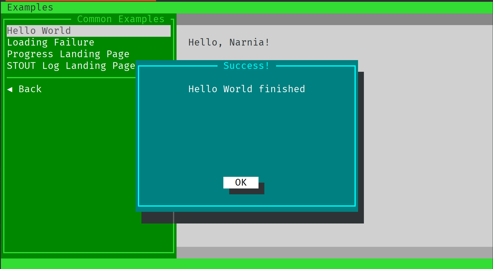
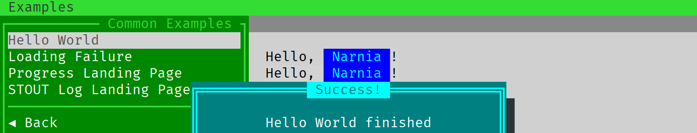

# Writing module (landing screen)

The landing screen is what is displayed _after_ user clicks on the form's button "Start".
In our "Hello, world" example it is that grey screen with two darker grey lines and a
"Hello, Narnia" text in it:



## Controlling alerting

Also you see that blue pop-up with "Success!" title. It does _not_ belong to the landing screen,
but shows only right after your program is finished. That means, that while your program is still
outputting something to the screen, this pop-up will not be shown.

Let's try that, shall we?

To do so, let's print "Hello, Narnia" three times with a time distance of a second. To do so,
let's change our shell script a bit in `run` function:

```bash
function run() {
    WORLD=$1
    for i in {1..3}
    do
	    echo "Hello, ${WORLD}!"
	    sleep 1
    done
}
```

This will print "Hello, Narnia!" three times and then show a pop-up "Success!".


## Pimping up your module

What else can be done? How about different colors in the output?

Let's write "Narnia" in blue. To do so, we are using dynamic colors. Dynamic colors are just
tags in square brackets with the color and background specified, also italic, bold attributes.
Let's change our `run` function how it echoes the data:

```bash
echo "[black]Hello, [aqua:blue] ${WORLD} [black:lightgrey]!"
```

A tag with a color name alone will change only a foreground. A tag with two colors, separated with a
semicolon will change foreground and background respectively:



Wonderful, but what are those two grey lines above and bottom?

These are:

- the title
- the status bar
  
Let's do something with the status bar during program execution. For example, it can tell us how many
iterations we need to still wait, and let us setup a title for it. To do so, we need to update our shell 
script function a bit. First, we need to control the loop range, so we need to write it a bit differently.
And we want to call API to set title and update our status:

```bash
function run() {
    WORLD=$1
    TIMES=3

    # Set the title
    api logger.title "Printing $WORLD $TIMES times"

    for (( i=1; i <= $TIMES; i++ ))
    do
	    echo "[black]Hello, [aqua:blue] ${WORLD} [black:lightgrey]!"

	    # Set the status bar
	    api logger.status "Iteration $i out of $TIMES"

	    sleep 1
    done
}
```

Here is what we've got at the end:


## Conclusion

Was it that hard? :-)

This concludes the tutorial how to write a module for Teabox. This covers all the concept around it.
But there is more! Check out API, use other landing windows and do not forget to update Teabox version
and re-check this documentation for the new stuff!
