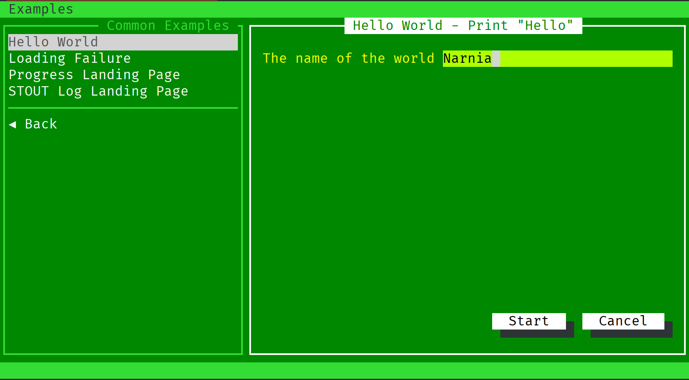
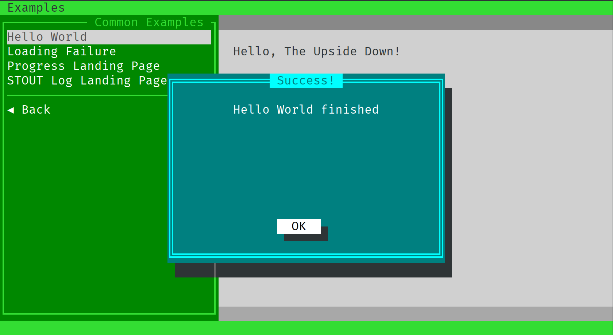
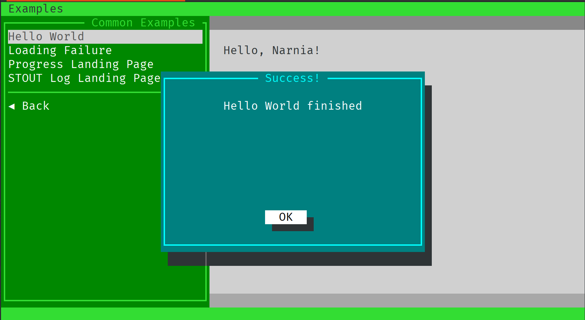

# Writing module (preloading via API)

You have your module, that by default is asking you to visit Mordor. But you don't want that.

To change this, you have to tell Teabox what value to place into a particular widget, before
it is shown at all. For this you need the following:

- The data you want to send to the Teabox
- Config of the UI definition to access its widgets
- The way to use the API via Unix socket

## Setting up API

This example is using already pre-made shell functions, which helps to setup everything.
Suite has also `lib` directory, which is meant to contain common used libraries for the
languages, used to implement the modules. In this particular example it is Bash shell.

To initialise all necessary settings and have all required functions, see the
`example/lib/shell/bash-common.sh` file. In particular, you need:

- Simple argument parsing/switching to provide `--setup` mode and just usual mode
- The way to call the API

### API initialisation

To initialise the API, add this snippet right at the beginning of the shell script:

```bash
SELF_PATH="$( cd -- "$(dirname "$0")" >/dev/null 2>&1 ; pwd -P )"
source $SELF_PATH/../../../lib/shell/bash-common.sh
```

What it does? It is looking for the `lib` directory alongside of the root `modules` directory
and includes `bash-common.sh` script, so you don't have to code all that all over again yourself.

### Add runtime function

Now we want out shell script do something meaningful and take arguments. In our case, all we want
is just to write "Hello, .... (something)". So we already defined in our UI that we want to accept
parameter `--name` which will specify to which world we say hello.

```bash
function run() {
    WORLD=$1
    echo "Hello, ${WORLD}!"
}
```

### Preparing setup mode

To make sure there is setup mode, let's also parse the arguments:

```bash
if [[ $# -eq 0 ]]; then
    run "world"
else
    while [[ $# -gt 0 ]]; do
        case $1 in
            -s|--setup)
                shift
                break
                ;;

            *)
                # This is a stranger things...
                run "The Upside Down"
                break
                ;;
        esac
    done
fi
```

We have to also add a clause to catch `--name`, place it before `*)` clause:

```bash
-n|--name)
    shift
    run $@
    break
    ;;
```

Now, if you call your script, it will do what it should:

```text
$ ./hello.sh
Hello, world!

$ ./hello.sh --name Narnia
Hello, Narnia!
```

### Preloading data
So how do we put "Narnia" instead of "Mordor" into the form, before it is even displayed?

As we added already all necessary functions, we need now to call Teabox API through its socket,
and access the widget, placing different value to the text field, so then the Teabox will call
our `hello.sh` script with the proper command line, as on the example above.

To do so, we define a setup function:

```bash
function setup() {
    api field.set.by-ord "{0}Narnia"
}
```

The first command in `setup` function is `api`. It is just a Bash shell function that accepts
two arguments:

1. Value (usually string)
2. Type (optionally, if it is not a string)

The API call `field.set.by-ord` accepts only a string value in key/value format, where key is
written within curly braces and the value follows. In this case, a text form field is first in
order, so we access it "by order", 0 in this case. Then we send a message what value to override.

Let's try this:

```text
$ ./hello.sh --setup      
nc: unix connect failed: Connection refused
nc: /tmp/teabox.sock: Connection refused
```

It works, well, almost. Now you need Teabox start the listener on `/tmp/teabox.sock` so the API will
actually do something meaningful, so just call it:



And voila, we now can go and visit Narnia instead of Mordor! Who needs to go to the Mordor, after all.
So let's try it:



Wait a second. Definitely not a Mordor, but fighting Vecna wasn't our plans either. Why we are here?

So if we look at our Bash shell script, we see that we need to adjust the way how named arguments are
parsed. Teabox constructs named arguments with `=` (equal) sign, like so:

    --name=Narnia

But our script expects it this way:

    --name Narnia

Let's change that. We need to grab everything that _starts with_ `--name=` and then cut it off, passing
the rest to the function `run`:

```bash
--name=*)
	run "${1#*=}"
	break
	;;
```

> NOTE: This tutorial does not covering Bash scripting tutorial. :-)

Let's try that again:



And yes. Your mouse works in this terminal window too, try it yourself!
